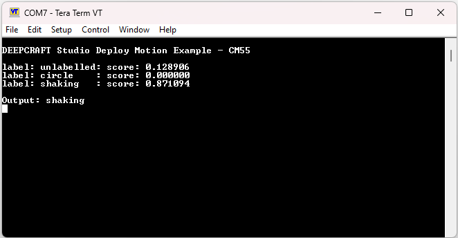
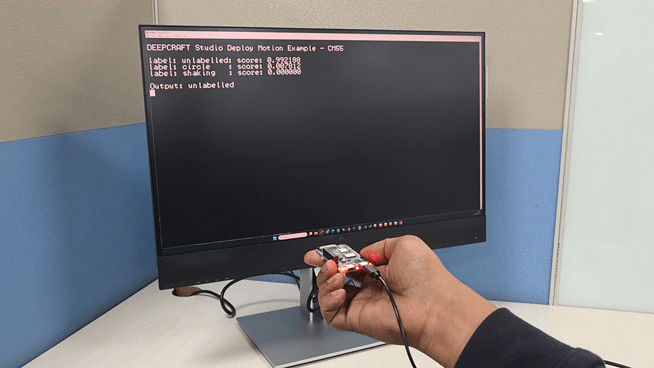
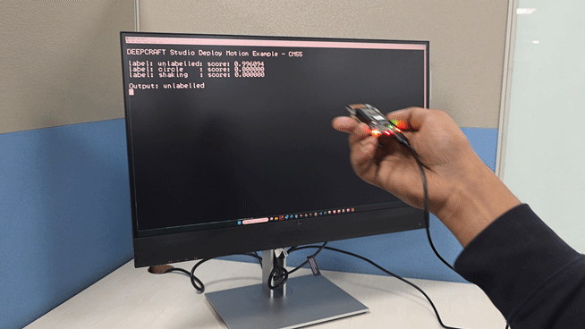

# PSOC&trade; Edge MCU: Machine learning – DEEPCRAFT&trade; deploy motion

This code example demonstrates how to deploy a machine learning (ML) model to detect motion generated using DEEPCRAFT&trade; Studio on Infineon's PSOC&trade; Edge MCU.

This example deploys DEEPCRAFT&trade; Studio's movement type detection starter model on the PSOC&trade; Edge MCU. This model uses data from the BMI270 IMU to detect various movement types such as shaking and circling.

The model can either be run on Arm&reg; Cortex&reg; M33 (CM33) or Cortex&reg; M55 (CM55) CPUs along with their accelerators. The application also requires basic preprocessing before the data can be fed to the inferencing block. The project provides files that include the model and preprocessing generated by DEEPCRAFT&trade; Studio. These codes are located in *model.c/.h* files in the *model* directory inside the CM33 NS and CM55 projects. New models based on the IMU data can be dropped into this example as they are. To collect the data using the [DEEPCRAFT&trade; Studio](https://www.imagimob.com/products), see the [DEEPCRAFT&trade; Studio Data Collection](https://github.com/Infineon/mtb-example-psoc-edge-ml-deepcraft-data-collection) code example.
> **Note:** On the KIT_PSE84_HMI, all three projects are programmed to the external OSPI flash instead of QSPI.

This code example has a three project structure: CM33 secure, CM33 non-secure, and CM55 projects. All three projects are programmed to the external QSPI flash and executed in Execute in Place (XIP) mode. Extended boot launches the CM33 secure project from a fixed location in the external flash, which then configures the protection settings and launches the CM33 non-secure application. Additionally, CM33 non-secure application enables CM55 CPU and launches the CM55 application.

[View this README on GitHub.](https://github.com/Infineon/mtb-example-psoc-edge-ml-deepcraft-deploy-motion)

[Provide feedback on this code example.](https://yourvoice.infineon.com/jfe/form/SV_1NTns53sK2yiljn?Q_EED=eyJVbmlxdWUgRG9jIElkIjoiQ0UyNDE1MjQiLCJTcGVjIE51bWJlciI6IjAwMi00MTUyNCIsIkRvYyBUaXRsZSI6IlBTT0MmdHJhZGU7IEVkZ2UgTUNVOiBNYWNoaW5lIGxlYXJuaW5nIOKAkyBERUVQQ1JBRlQmdHJhZGU7IGRlcGxveSBtb3Rpb24iLCJyaWQiOiJuaWNob2xhcy5zaGFycEBpbmZpbmVvbi5jb20iLCJEb2MgdmVyc2lvbiI6IjIuNC4yIiwiRG9jIExhbmd1YWdlIjoiRW5nbGlzaCIsIkRvYyBEaXZpc2lvbiI6Ik1DRCIsIkRvYyBCVSI6IklDVyIsIkRvYyBGYW1pbHkiOiJQU09DIn0=)

See the [Design and implementation](docs/design_and_implementation.md) for the functional description of this code example.

## Requirements

- [ModusToolbox&trade;](https://www.infineon.com/modustoolbox) v3.7 or later (tested with v3.8)
- Board support package (BSP) minimum required version: 1.0.0
- Programming language: C
- Associated parts: All [PSOC&trade; Edge MCU](https://www.infineon.com/products/microcontroller/32-bit-psoc-arm-cortex/32-bit-psoc-edge-arm) parts

## Supported toolchains (make variable 'TOOLCHAIN')

- GNU Arm&reg; Embedded Compiler v14.2.1 (`GCC_ARM`) – Default value of `TOOLCHAIN`
- Arm&reg; Compiler v6.22 (`ARM`)
- LLVM Embedded Toolchain for Arm&reg; v19.1.5 (`LLVM_ARM`)

> **Note:**
> 1. IAR is not supported by TensorFlow Lite for the Microcontrollers (TFLM) library
> 2. This code example fails to build in RELEASE mode with the GCC_ARM toolchain v14.2.1 as it does not recognize some of the Helium instructions of the CMSIS-DSP library. This issue is not present in the ARM&reg; Compiler for Embedded (armclang)
> 3. This code example currently supports the VFP_SELECT option "hardfp" only. Setting "softfp" may cause build failure.

## Supported kits (make variable 'TARGET')

- [PSOC&trade; Edge E84 AI Kit](https://www.infineon.com/KIT_PSE84_AI) (`KIT_PSE84_AI`) – Default value of `TARGET`
- [PSOC&trade; Edge E84 Evaluation Kit](https://www.infineon.com/KIT_PSE84_EVAL) (`KIT_PSE84_EVAL_EPC2`)
- [PSOC&trade; Edge E84 Evaluation Kit](https://www.infineon.com/KIT_PSE84_EVAL) (`KIT_PSE84_EVAL_EPC4`)
- [PSOC&trade; Edge E84 HMI Kit](https://www.infineon.com/KIT_PSE84_HMI) (`KIT_PSE84_HMI`)

## Hardware setup

This example uses the board's default configuration. See the kit user guide to ensure that the board is configured correctly.

Ensure the following jumper and pin configuration on board.
- BOOT SW must be in the HIGH/ON position
- J20 and J21 must be in the tristate/not connected (NC) position for the PSOC&trade; Edge E84 Evaluation Kit

> **Note:** This hardware setup is not required for KIT_PSE84_AI.

## Software setup

See the [ModusToolbox&trade; tools package installation guide](https://www.infineon.com/ModusToolboxInstallguide) for information about installing and configuring the tools package.

Install a terminal emulator if you do not have one. Instructions in this document use [Tera Term](https://teratermproject.github.io/index-en.html).

This example requires no additional software or tools.

## Operation

See [Using the code example](docs/using_the_code_example.md) for instructions on creating a project, opening it in various supported IDEs, and performing tasks, such as building, programming, and debugging the application within the respective IDEs.

1. The example can be configured to run the model on either CM33 or the CM55 (default) CPUs. In the *common.mk* file, set `ML_DEEPCRAFT_CPU` to 'cm33' or 'cm55' based on your CPU. You can set the quantization and inference engine settings in the CM33 NS and CM55 project Makefiles. You can enable the sensors as needed from *common.mk* file, set `IMU_ENABLE_SENSOR` to 'ACCELEROMETER', 'GYROSCOPE' or 'ACCELEROMETER_GYROSCOPE' based on your model requirement

   **Table 1. Model Inferencing Configurations**

   Location    | Parameter | Option    | Description
   :--------   | :-------- | :-------- | :--------
   *common.mk* | `ML_DEEPCRAFT_CPU`    | 'cm55' or 'cm33' | Switch between running the model on cm55 or cm33 CPUs; default is 'cm55'
   *proj_cmxx/Makefile*    | `NN_TYPE` | 'float' or 'int8x8' | Switch if the model is float or int8 quantization. This is controlled per core; default is 'int8x8'
   *common.mk* | `IMU_ENABLE_SENSOR` | 'ACCELEROMETER', 'GYROSCOPE' or 'ACCELEROMETER_GYROSCOPE' |  To enable accelerometer only or gyroscope only or both accelerometer and gyroscope; default is 'ACCELEROMETER_GYROSCOPE'

    

   > **Note:** The model provided as part of the code example supports int8x8 quantization only.

2. Connect the board to your PC using the provided USB cable through the KitProg3 USB connector

3. Open a terminal program and select the KitProg3 COM port. Set the serial port parameters to 8N1 and 115200 baud

4. After programming, the application starts automatically. Confirm that "DEEPCRAFT Studio Deploy Motion Example - CMxx" is displayed on the UART terminal. Additionally, observe the 'User LED1' on the kit blink, indicating the continuous processing of the IMU data

   **Figure 1. Terminal output**

   

5. While holding the kit board in your hand, perform various movement types such as shaking or circling and observe if the model detects and reports the correct movement type

   For proper detection, the sensor on the board must be oriented in the same general way in which it is trained. The orientation for shaking and circling are shown in **Figure 2** and **Figure 3** respectively

   **Figure 2. Performing a shaking gesture**

   

   **Figure 3. Performing a circle gesture**

   

The code example can be updated to use other starter models from DEEPCRAFT&trade; Studio. For more information, see [Deploy model on PSOC&trade; 6 and PSOC&trade; Edge boards](https://developer.imagimob.com/deepcraft-studio/deployment/deploy-models-supported-boards/deploy-model-PSOC-6-PSOC-Edge). For details on generating, optimizing, and validating the model code using DEEPCRAFT&trade; Studio, see [Code generation for Infineon boards](https://developer.imagimob.com/deepcraft-studio/code-generation/code-gen-infineon-boards).

> **Note:**
> 1. The model provided in this example is taken from the starter models from DEEPCRAFT&trade; Studio and is not production ready. You can develop your own models in DEEPCRAFT&trade; Studio and use this example to deploy them on PSOC&trade; Edge MCU by replacing the corresponding .c/.h files.
> 2. By default, the orientation of the BMI270 sensor is aligned with the PSOC&trade; 6 AI Evaluation Kit. To disable this alignment, set the `SENSOR_REMAPPING` macro to `DISABLED` in the common.mk file.

## Related resources

Resources  | Links
-----------|----------------------------------
Application notes  | [AN235935](https://www.infineon.com/AN235935) – Getting started with PSOC&trade; Edge E8 MCU on ModusToolbox&trade; software
Code examples  | [Using ModusToolbox&trade;](https://github.com/Infineon/Code-Examples-for-ModusToolbox-Software) on GitHub
Device documentation | [PSOC&trade; Edge MCU datasheets](https://www.infineon.com/products/microcontroller/32-bit-psoc-arm-cortex/32-bit-psoc-edge-arm#documents)   [PSOC&trade; Edge MCU reference manuals](https://www.infineon.com/products/microcontroller/32-bit-psoc-arm-cortex/32-bit-psoc-edge-arm#documents)
Development kits | Select your kits from the [Evaluation board finder](https://www.infineon.com/cms/en/design-support/finder-selection-tools/product-finder/evaluation-board)
Libraries  | [mtb-dsl-pse8xxgp](https://github.com/Infineon/mtb-dsl-pse8xxgp) – Device support library for PSE8XXGP   [retarget-io](https://github.com/Infineon/retarget-io) – Utility library to retarget STDIO messages to a UART port
Tools  | [ModusToolbox&trade;](https://www.infineon.com/modustoolbox) – ModusToolbox&trade; software is a collection of easy-to-use libraries and tools enabling rapid development with Infineon MCUs for applications ranging from wireless and cloud-connected systems, edge AI/ML, embedded sense and control, to wired USB connectivity using PSOC&trade; Industrial/IoT MCUs, AIROC&trade; Wi-Fi and Bluetooth&reg; connectivity devices, XMC&trade; Industrial MCUs, and EZ-USB&trade;/EZ-PD&trade; wired connectivity controllers. ModusToolbox&trade; incorporates a comprehensive set of BSPs, HAL, libraries, configuration tools, and provides support for industry-standard IDEs to fast-track your embedded application development

 

## Other resources

Infineon provides a wealth of data at [www.infineon.com](https://www.infineon.com) to help you select the right device, and quickly and effectively integrate it into your design.

## Document history

Document title: *CE241524* – *PSOC&trade; Edge MCU: Machine learning – DEEPCRAFT&trade; deploy motion*

 Version | Description of change
 ------- | ---------------------
 1.x.0   | New code example   Early access release
 2.0.0   | GitHub release
 2.1.0   | Updated to support new model and CE structure
 2.2.0   | Aligned BMI270 sensor orientation with CY8CKIT-062S2-AI
 2.3.0   | Updated design files to fix ModusToolbox&trade; v3.7 build warnings
 2.4.0   | Added support for KIT_PSE84_HMI
 2.4.1   | Added a check for unsupported build configuration.
 2.4.2   | ECO configurations update for KIT_PSE84_HMI
 

All referenced product or service names and trademarks are the property of their respective owners.

The Bluetooth&reg; word mark and logos are registered trademarks owned by Bluetooth SIG, Inc., and any use of such marks by Infineon is under license.

PSOC&trade;, formerly known as PSoC&trade;, is a trademark of Infineon Technologies. Any references to PSoC&trade; in this document or others shall be deemed to refer to PSOC&trade;.

---------------------------------------------------------

(c) 2023-2026, Infineon Technologies AG, or an affiliate of Infineon Technologies AG. All rights reserved.
This software, associated documentation and materials ("Software") is owned by Infineon Technologies AG or one of its affiliates ("Infineon") and is protected by and subject to worldwide patent protection, worldwide copyright laws, and international treaty provisions. Therefore, you may use this Software only as provided in the license agreement accompanying the software package from which you obtained this Software. If no license agreement applies, then any use, reproduction, modification, translation, or compilation of this Software is prohibited without the express written permission of Infineon.
 
Disclaimer: UNLESS OTHERWISE EXPRESSLY AGREED WITH INFINEON, THIS SOFTWARE IS PROVIDED AS-IS, WITH NO WARRANTY OF ANY KIND, EXPRESS OR IMPLIED, INCLUDING, BUT NOT LIMITED TO, ALL WARRANTIES OF NON-INFRINGEMENT OF THIRD-PARTY RIGHTS AND IMPLIED WARRANTIES SUCH AS WARRANTIES OF FITNESS FOR A SPECIFIC USE/PURPOSE OR MERCHANTABILITY. Infineon reserves the right to make changes to the Software without notice. You are responsible for properly designing, programming, and testing the functionality and safety of your intended application of the Software, as well as complying with any legal requirements related to its use. Infineon does not guarantee that the Software will be free from intrusion, data theft or loss, or other breaches (“Security Breaches”), and Infineon shall have no liability arising out of any Security Breaches. Unless otherwise explicitly approved by Infineon, the Software may not be used in any application where a failure of the Product or any consequences of the use thereof can reasonably be expected to result in personal injury.
