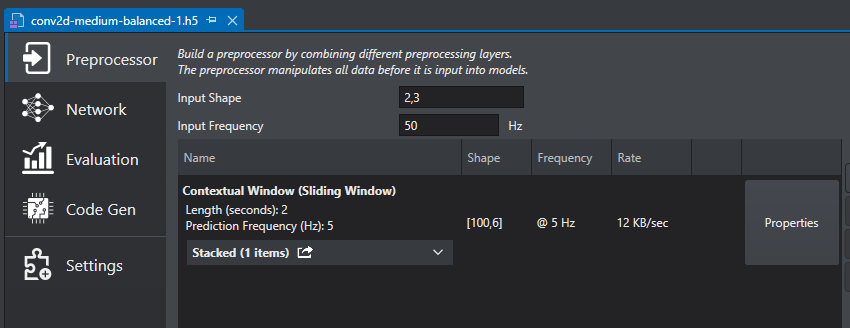
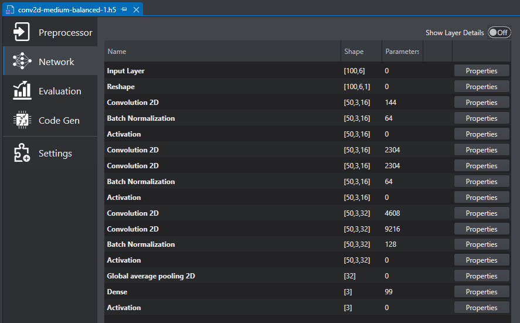
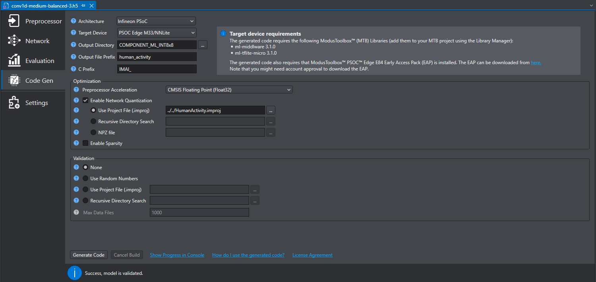
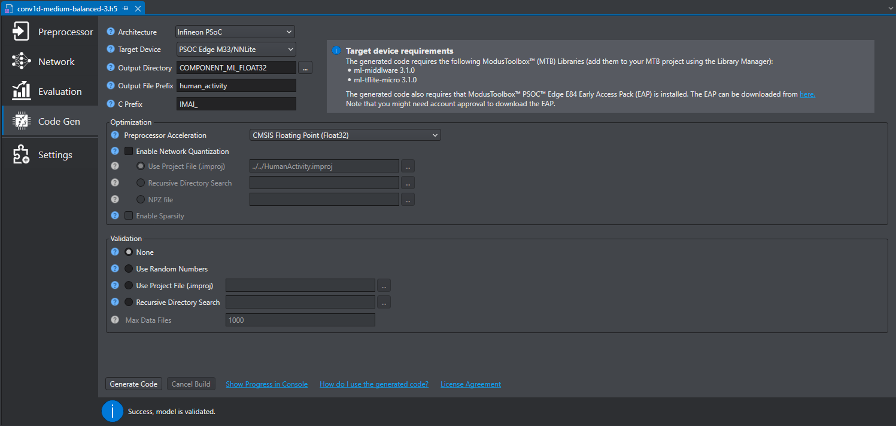
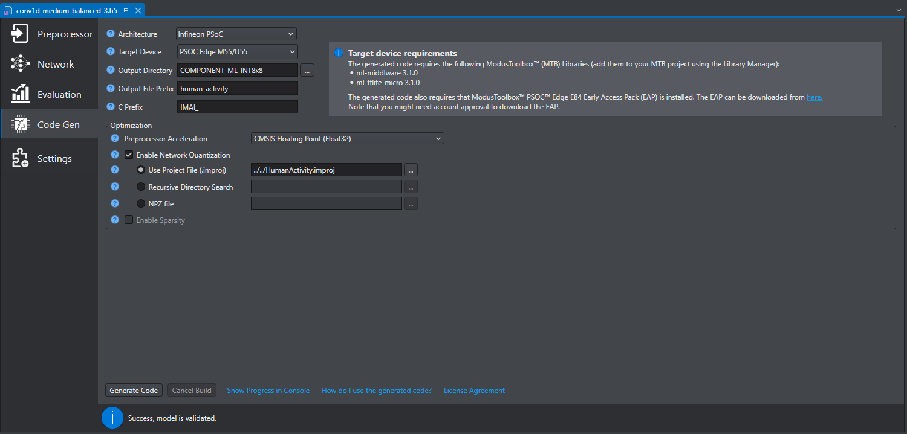
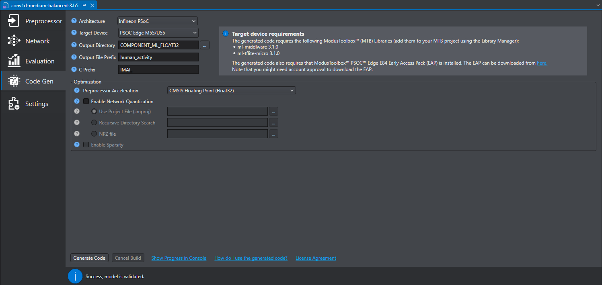

[Click here](../README.md) to view the README.

## Design and implementation

The design of this application is minimalistic to get started with code examples on PSOC&trade; Edge MCU devices. All PSOC&trade; Edge E84 MCU applications have a dual-CPU three-project structure to develop code for the CM33 and CM55 cores. The CM33 core has two separate projects for the secure processing environment (SPE) and non-secure processing environment (NSPE). A project folder consists of various subfolders, each denoting a specific aspect of the project. The three project folders are as follows:

**Table 1. Application projects**

Project | Description
--------|------------------------
*proj_cm33_s* | Project for CM33 secure processing environment (SPE)
*proj_cm33_ns* | Project for CM33 non-secure processing environment (NSPE)
*proj_cm55* | CM55 project

 

### Human activity detection

This example includes the human activity detection model that works out-of-box without requiring any changes.

The model takes data from a motion sensor (BMI270) to detect various activities based on the "Human Activity Detection" starter project in DEEPCRAFT&trade; Studio. These activities are standing, running, walking, sitting, and jumping.

DEEPCRAFT&trade; Studio generates the *human_activity.c/h* file that contains the code required for processing the data before being fed to the ML model and the code needed for model inferencing. 

The input data consists of the 3-axis accelerometer raw data from the BMI270 IMU. The data from the IMU is configured at 50 Hz data rate and the PSOC&trade; Edge MCU receives the data from IMU once every 200 ms. This is achieved using the internal hardware FIFO within the BMI270 IMU – only when adequate number of samples are received (based on the FIFO watermark level), a hardware interrupt triggers the PSOC&trade; Edge MCU to receive the FIFO data and perform data processing. 

All IMU-related configurations are set in the *shared_src/config.h* file. The data received from FIFO is fed into the data processing code generated by DEEPCRAFT&trade; Studio using the `IMAI_enqueue` API after 10 accelerometer frames are received. After the processing is done, the `IMAI_dequeue` API returns the results as scores corresponding to each label. All label scores along with the label corresponding to the maximum score is printed on the UART terminal.

The pre-processor uses a 50-frame sliding window for evaluating the data over a period of 1 second as the data rate is 50 Hz. The preprocessing layers for the human activity detection application is shown in **Figure 1**.

**Figure 1. Human activity detection pre-processing layers**

As shown in **Figure 2**, the model is a standard convolutional neural network (CNN) model consisting of five convolutional groups. These groups are divided into three groups of convolutional blocks (one or two layers), a batch normalization layer, a rectified linear unit (ReLU) activation layer, and a max pooling layer.

**Figure 2. Human activity detection model layers**

The convolutional layers act as feature extractors and provide abstract representations of the input sensor data in the feature maps. They capture short-term dependencies (spatial relationships) of the data. In CNN, features are extracted and used as inputs to latter feature extractors. Finally, a softmax activation is used for the final classification.

### Memory placement of model and arena data

On CM33 + NNLite, it is recommended to place the model weights and arena data in the SRAM for best performance. Place the model weights by defining the `CY_ML_MODEL_MEM` macro to the desired memory section from the CM33 NS linker script. For the arena data, use the `CY_ML_ARENA_MEM` macro. 

In this code example, the `CY_ML_MODEL_MEM` macro is set to the `.cy_sram_code` section using the CM33 project *Makefile*, ensuring the model data is placed in SRAM for optimal performance. The `CY_ML_ARENA_MEM` macro is not defined in this example so the arena buffer gets placed in the default data segment. 

> **Note:** The memory section to which the macros are assigned must be defined in the CM33 NS linker script.

On CM55 + U55, it is recommended to place the model weights in the system SRAM (SoCMEM) for best performance while the arena data must be placed in the system SRAM (SoCMEM) for the proper functioning of the application. Configure the model data placement using the `CY_ML_MODEL_MEM` macro and the arena data using the `CY_ML_ARENA_MEM` macro. 

In this code example, both `CY_ML_MODEL_MEM` and `CY_ML_ARENA_MEM` macros are set to the `.cy_socmem_data` section using the CM55 project Makefile, ensuring the model and arena data are placed in the System SRAM (SoCMEM) for optimal performance. 

> **Note:** The memory section to which the macros are assigned must be defined in the CM55 linker script.

### Generating the model

This code example ships with the *human_activity.c/h* files produced by DEEPCRAFT&trade; Studio. Use DEEPCRAFT&trade; Studio to capture the new data and review, modify, or generate new models for evaluation. To get the generated codes for a modified model or a new model, set the following configurations in the **Code Gen** tab of the model file in DEEPCRAFT&trade; Studio before clicking **Generate Code**. For more information on starter projects of DEEPCRAFT&trade; Studio visit [DEEPCRAFT&trade; Studio starter projects](https://www.imagimob.com/starter-models#sf-block=2218)

**Figure 3** shows the configurations for the CM33 + NNLite target with int8x8 quantization, **Figure 4** shows the configurations for the CM33 + NNLite target with float quantization, **Figure 5** shows the configurations for the CM55 + U55 target with int8x8 quantization, and **Figure 6** shows the configurations for the CM55 + U55 target with float quantization.

**Figure 3. Code generation settings for CM33 + NNLite, with int8x8 quantization**

**Figure 4. Code generation settings for CM33 + NNLite, with float quantization**

**Figure 5. Code generation settings for CM55 + U55, with int8x8 quantization**

**Figure 6. Code generation settings for CM55 + U55, with float quantization**

The output folder *COMPONENT_ML_INT8x8/COMPONENT_ML_FLOAT32* contains the *human_activity.c/h* files. These files contain the data pre-processing as well as model inferencing code. The generated *COMPONENT_ML_INT8x8/COMPONENT_ML_FLOAT32* folder can be copied into the *Models/COMPONENT_CMxx* folder of the ModusToolbox&trade; application.

### Running the generated model

1. Copy the generated *COMPONENT_ML_INT8x8/COMPONENT_ML_FLOAT32* folder to the *Models/COMPONENT_CMxx* folder of the ModusToolbox&trade; application
   
2. Include the header file of the generated model in the *shared_src/imu.h* file. For example, if the output file prefix during the model code generation is set to `human_activity`, then include `#include "human_activity.h"` in the *shared_src/imu.h* file.

3. Open the *common.mk* file and set `ML_DEEPCRAFT_CPU` to 'cm55' or 'cm33'

4. Open the *proj_cmxx/Makefile* file and set `NN_TYPE` to 'int8x8' or 'float' to select the desired quantization

5. Program the device as described in the [Operation](../README.md#operation) Section

 